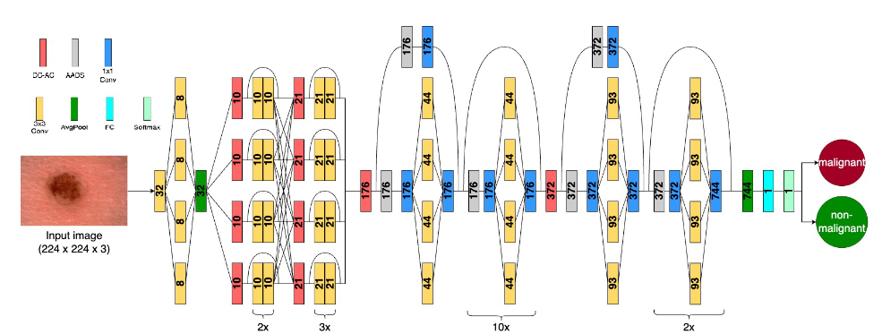
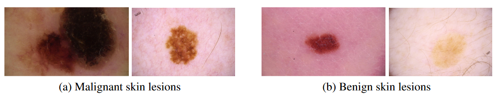

# Cancer-Net Open Source Initiative - Cancer-Net SCa

<p align="center">
	
	<br>
</p>

**Update 2024-02-11:** We added the pretrained Cancer-Net SCa-DC-AC model (Double-Condensing Attention Condenser) in the `models` folder.

**Note: The Cancer-Net SCa models provided here are intended to be used as reference models that can be built upon and enhanced as new data becomes available. They are currently at a research stage and not yet intended as production-ready models (not meant for direct clinical diagnosis), and we are working continuously to improve them as new data becomes available. Please do not use Cancer-Net SCa for self-diagnosis and seek help from your local health authorities.**

**Cancer-Net SCa is part of the Cancer-Net initiatives, a parallel initiative to the [COVID-Net initiative](www.covid-net.ml).**

<p align="center">
	
	<br>
</p>

<p align="center">
	
	<br>
	<em>Example skin lesion images.</em>
</p>

Skin cancer is the most common type of cancer in the United States and is estimated to affect one in five Americans. Recent advances have demonstrated strong performance on skin cancer detection, as exemplified by state of the art performance in the SIIM-ISIC Melanoma Classification Challenge; however these solutions leverage ensembles of complex deep neural architectures requiring immense stor-
age and compute costs, and therefore may not be tractable. A recent movement for TinyML applications is integrating Double-Condensing Attention Condensers (DC-AC) into a self-attention neural network backbone architecture to allow for faster and more efficient computation. This paper explores leveraging an efficient self-attention structure to detect skin cancer in skin lesion images and introduces a deep neural network design with DC-AC customized for skin cancer detection from skin lesion images. The final model is publicly available as a part of a global open-source initiative dedicated to accelerating advancement in machine learning to aid clinicians in the fight against cancer.

For a detailed description of the methodology behind Cancer-Net SCa-DC-AC and a full description of the dataset used, please click [here](https://arxiv.org/abs/2311.11656).

Our desire is to encourage broad adoption and contribution to this project. Accordingly this project has been licensed under the GNU Affero General Public License 3.0. Please see [license file](LICENSE.md) for terms.

If there are any technical questions after the README, FAQ, and past/current issues have been read, please post an issue or contact:
* amy.tai@uwaterloo.ca
* eljanes@uwaterloo.ca

## Quick Links
1. Cancer-Net SCa models (Initial cancer detection models for skin cancer): https://github.com/jamesrenhoulee/CancerNet-SCa/blob/main/docs/models.md
2. ISIC 2020 dataset: https://challenge2020.isic-archive.com/

## Core Cancer-Net SCa Team
* Canada and Vision and Image Processing Research Group, University of Waterloo, Canada
	* Alexander Wong
* Vision and Image Processing Research Group, University of Waterloo, Canada
	* Amy Tai
    * Elizabeth Janes
    * Chris Czarnecki
    
## Demo
A demo of model inference with the Cancer-Net SCa-DC-AC model on a provided sample skin lesion image can be run with:
`python ISIC2020_evaluate.py`.


## Citation

**Cancer-Net SCa-DC-AC**
```
@inproceedings{cancer-net-sca-attendnext,
     title = {Double-Condensing Attention Condenser: Leveraging Attention in Deep Learning to Detect Skin Cancer from Skin Lesion Images},
     author = {Tai, Chi-en Amy and Janes, Elizabeth and Czarnecki, Chris and Wong, Alexander},
     booktitle = {Conference and Workshop on Neural Information Processing Systems (NeurIPS)},
         series = {Medical Imaging Meets NeurIPS Workshop (MED-NeurIPS)},
     year = {2023},
    url = {https://arxiv.org/abs/2311.11656%7D}
}
```
